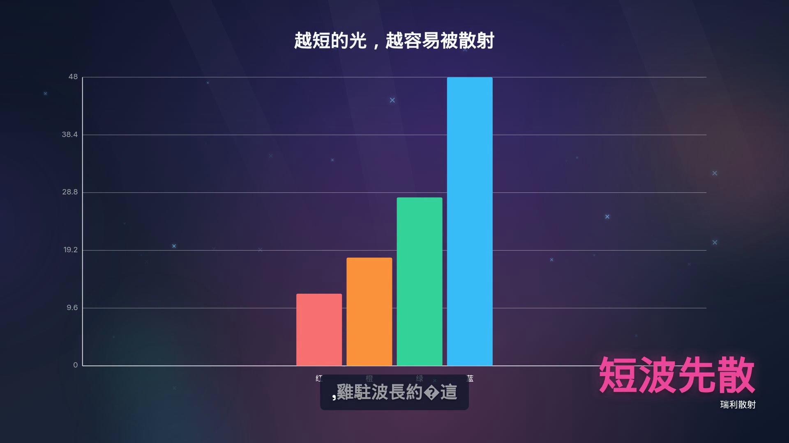

# 有声科普片验证记录

官方 `make demo` 是无声展示片。有声路径：

```bash
python scripts/zero_cost_explainer.py fixtures/zero-cost/why-sky-is-blue.json
```

成片在 `projects/why-sky-is-blue/renders/final.mp4`（gitignore）。Pixabay BGM 本机返回 403/空结果，因此只有 Piper 中文旁白 + 字幕，没有背景音乐。

口播对照 [ai_video01](https://github.com/Tomhao10225101490/ai_video01) **只学节奏、不换 Edge 音色**：按 `。！？` 一句一合成、句间气口、钩子略快；concat 后走 `voice_clarity`（高通 + 存在感 EQ + loudnorm）；字幕用 faster-whisper 字级时间轴（没有 whisper 则回退按时长均分汉字）。Piper 仍是 `zh_CN-huayan-medium`。画面 `motion_energy: high`。

## 探测结果

| 项 | 值 |
|----|----|
| 时长 | 78.19s |
| 分辨率 | 1920×1080 30fps |
| 视频 | h264 |
| 音频 | aac stereo 48kHz |
| 音量 | 成片 mean **-19.3 dB**；增强后旁白 **-16.2 dB**（loudnorm 目标约 -16） |
| 体积 | 31.3 MB |
| 旁白 | Piper 按句合成 + `voice_clarity` |
| 字幕 | whisper 200 words / 244 cues |

钩子帧（「先别划走」+ 光束/闪点）：


中间帧（瑞利散射柱状图 + 「短波先散」）：



`zero_cost_preflight.py` 中文试合成 `天空是蓝色的。` mean_volume **-13.5 dB**。
